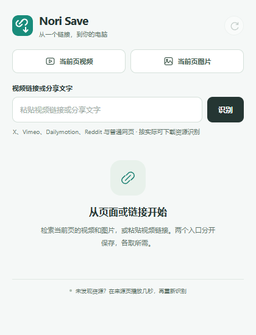
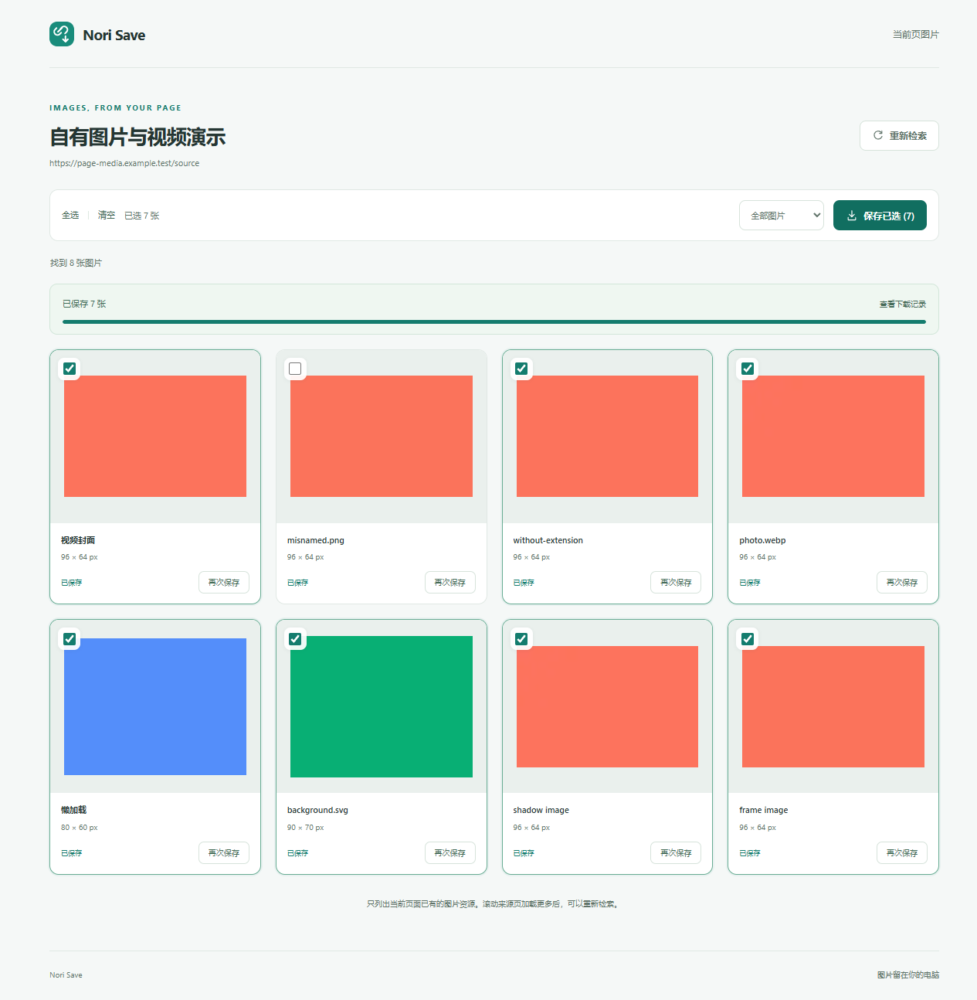

# Nori Save


检索当前页面的视频和图片，或粘贴视频链接、分享文字，将网页实际提供的资源保存到你的电脑。视频与图片使用独立入口。Nori Save 是独立的 Chrome / Edge 扩展，采用自制链环图标，与任何平台无隶属关系。

## 安装与使用

1. 下载项目，或解压扩展包。
2. Chrome 打开 `chrome://extensions/`，Edge 打开 `edge://extensions/`，开启「开发者模式」。
3. 点击「加载已解压的扩展程序」，选择 `extension` 文件夹（包含 `manifest.json` 的一层）。
4. 点击 Nori Save 图标，选择「当前页视频」「当前页图片」，或粘贴视频链接、分享文字再点击「识别」。
5. 视频识别后选择清晰度再下载；图片在独立图库里预览、选择和保存。视频文件格式随资源显示，例如 MP4 或 WebM；HLS 下载完成后显示实际输出格式。



识别时会打开来源页，查找页面播放器或网页请求中实际暴露的视频资源。没有发现资源时，在来源页播放几秒，再点击「重新识别」。部分网页需要用户先登录或开始播放，结果取决于当前页面实际提供的资源。

完成前保持下载进度页打开。默认保存到浏览器下载目录，也可以选择每次询问保存位置。用户安装扩展无需运行服务器、安装 FFmpeg 或配置账号密码；处理代码随扩展提供，不加载在线脚本。

## 当前页面的两个入口

- **当前页视频**：用户点击后检索当前普通网页，查找播放器和已观察到的视频请求，识别结果与链接入口共用清晰度及下载流程。没有资源时可先在来源页播放几秒，再重新检索。
- **当前页图片**：打开独立图库，读取来源页面当前 DOM 中已有的图片资源。支持完整横竖图预览、全选、清空、尺寸筛选，以及单张或选中多张保存。懒加载图片需要先在来源页滚动加载，再重新检索。

图片每张最多 32 MB，支持 JPEG、PNG、WebP、GIF、AVIF、SVG、BMP、ICO；保存前检查图片响应的类型与传输完整性，文件后缀按真实 MIME 类型确定。图片保存到浏览器下载目录中的 `Nori Save-images/页面标题/`，图库仅在浏览器报告下载完成后标记已保存。受登录、请求限制或无效资源影响的图片会显示真实失败原因。



## 链接与资源范围

| 链接类型 | 识别方式与范围 |
| --- | --- |
| X | 专用公开资源适配，识别公开帖子提供的 MP4 清晰度；私有、登录受限或不可访问资源会正常失败。 |
| Dailymotion | 专用公开播放器适配，优先提供 MP4，否则识别公开 HLS；访问限制及受保护资源会给出原因。 |
| Vimeo | 条件读取公开播放器配置；优先 MP4，否则尝试 HLS。加密或 DRM 资源明确拒绝；未宣称已通过真实视频完整下载。 |
| Reddit、其他普通网页 | 通用资源发现，查找播放器或页面请求中的 MP4、WebM、HLS；没有网站专用稳定保证。 |
| 媒体直链 | 可访问且符合支持格式的文件按实际格式保存。 |
| 包含链接的分享文字 | 提取其中的链接，按来源页面或媒体资源处理。 |

专用适配也不表示所有页面、所有播放器或所有清晰度都可下载。只有识别到可处理的资源才会显示选项；无法访问、资源受保护或格式不受支持时会显示具体原因。

- MP4、WebM 文件按网页提供的格式保存，不重新编码。
- HLS 只处理已结束且未加密的视频。合并的 fMP4，以及 fMP4 视频加独立 AAC 音轨，保存为 MP4；MPEG-TS 分段合并保存为 `.ts`，需要本地播放器播放。HLS 默认选择最高可用清晰度。
- 支持取消、失败重试和重新识别来源。直播、加密、时间轴不连续或当前无法处理的音轨组合会给出失败原因。
- YouTube 与其他需要专用签名或 DASH 解析的网站目前不支持。
- 单任务媒体输入合计最多 512 MB；最多开始 3 个同时运行的任务。
- 不提供登录、付费权限、解密或 DRM 绕过功能。

## 隐私

只有用户提交链接或点击当前页视频、图片入口后才读取相应来源页面，不自动扫描全站浏览记录。没有维护者服务器或分析统计，不主动读取、保存或导出 Cookie、密码，图片不上传到维护者服务。

扩展声明所有 HTTP(S) 网站的技术访问权限，以支持不同来源的网站及媒体 CDN。视频网络观察限于用户选择的来源标签页，最长保留 1 小时，关闭该标签页时释放；图片检索由用户触发，只读取相应页面当前已有的 DOM 资源。来源链接、临时媒体地址、视频信息与任务保存在浏览器当前会话；偏好设置保存在本地。来源网页自身的网络活动由网站及浏览器管理。[完整隐私说明](PRIVACY.md)

## 开发

需要 Node.js 22+。用户安装扩展不需要这些开发依赖。

```sh
npm ci
npm test
```

媒体合成检查需要 FFmpeg / FFprobe 在 PATH，或设置 `FFMPEG` / `FFPROBE` 为其路径。测试使用人工构造的资源和自行生成的音视频，不需要下载第三方视频。`npm test` 包含媒体合成、HLS、X 与公开播放器适配、链接处理和文件校验回归。

浏览器检查：

```sh
npx playwright install chromium
npm test
npm run test:browser
```

Windows 默认使用 Edge；其他系统使用 Playwright Chromium。`NORI_SAVE_QA_BROWSER` 可以指定兼容浏览器的完整路径。`npm run test:common` 用于通用网页与资源格式的浏览器检查。真实网站联网验证与离线回归分别记录；联网验证会实际访问来源站点并下载所选样本。

`npm run test:page` 检查当前页视频与图片两个入口；`npm run test:hls-browser` 检查分段视频的完整保存。`npm run test:common -- --mock-only` 只运行自生成资源；`npm run test:common -- --live-only` 运行公开 X 样本的联网检查。其他公开视频链接可通过 `NORI_SAVE_TEST_URL` 与 `npm run test:live` 检查。[本版验证范围](docs/verification.md)

- `extension/lib/`：链接处理、网页资源识别、文件校验与媒体合成。
- `extension/background.js`：来源页、会话任务和媒体请求管理。
- `extension/download.js`：进度、取消、重试与浏览器保存状态。
- `extension/images.*`：独立的当前页图库、选择与保存反馈。
- `extension/popup.*`、`download.*`、`icons/icon.svg`：界面与独立图标；`npm run icons` 重新生成 PNG。

## 验证与发布

离线媒体检查、浏览器回归和真实网站检查分别验证不同范围。Dailymotion 的一个公开短视频样本已通过 Edge 扩展的识别、HLS 下载、浏览器完整保存及音画检查，完整解码通过。Vimeo 的真实配置与子清单识别已验证，样本因 DRM 被拒绝，未宣称实际下载成功。其他网站的专用检查与扩展完整保存验证应按发布版本的实际结果记录。

链接能提交、资源能识别或单个样本下载成功，都不代表某个网站全面支持。发布说明应记录实际通过的浏览器、资源类型与网站样本，以及尚未验证的部分。

`tools/fixtures/` 使用人工构造的回归数据。`evidence/`、浏览器测试配置、下载文件、`node_modules/` 和压缩包均从 Git 排除。发布时使用源码包，勿将整个工作目录连同本地测试资料上传。

`npm run package` 生成 `Nori-Save-extension.zip`（解压后加载）和 `Nori-Save-GitHub-source.zip`（适合发布的源码）。源码包采用明确的文件清单，不包含本地证据和测试视频。

原创代码采用 [MIT](LICENSE)；本地 MP4Box.js 2.4.1 保留 [BSD-3-Clause 许可证](extension/vendor/MP4Box-LICENSE.txt)。[贡献说明](CONTRIBUTING.md) · [安全反馈](SECURITY.md)
